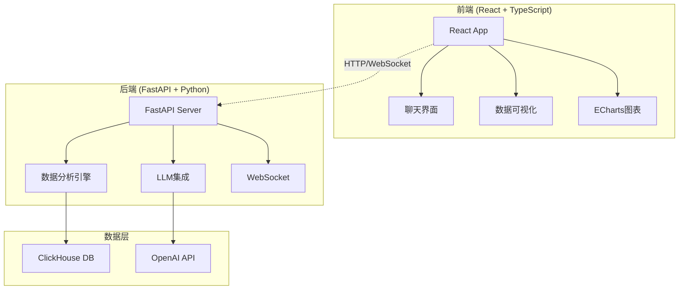

## 系统架构设计

### 1. **后端API服务** (Python FastAPI + LLM)### 2. **前端应用** (React + TypeScript)### 3. **环境配置文件**## 🎯 完整的前后端分离架构设计

我已经为您创建了一个完整的前后端分离架构，集成了LLM功能。以下是系统概览：

### 系统架构



### 核心功能

1. **智能对话系统**
   - 集成OpenAI GPT模型
   - 理解自然语言查询
   - 基于数据上下文生成回答

2. **实时数据分析**
   - 连接ClickHouse数据库
   - 因果推断分析
   - 销售预测功能

3. **可视化展示**
   - 数据指标卡片
   - 趋势图表
   - 交互式分析报告

4. **响应式UI设计**
   - 采用您提供的绿色主题
   - Tailwind CSS样式
   - 优雅的聊天界面

### 快速开始

1. **克隆项目并安装依赖**
```bash
# 安装后端依赖
pip install -r requirements.txt

# 安装前端依赖
cd frontend && npm install
```

2. **配置环境变量**
```bash
cp .env.example .env
# 编辑.env文件，填入OpenAI API密钥等配置
```

3. **启动服务**
```bash
# 方式一：使用快速启动脚本
chmod +x quickstart.sh
./quickstart.sh

# 方式二：使用Docker
docker-compose up

# 方式三：手动启动
# 后端: uvicorn backend_api:app --reload
# 前端: cd frontend && npm start
```

### API接口示例

1. **聊天接口**
```javascript
POST /api/chat
{
  "message": "我想看看今天的数据分析报告"
}
```

2. **获取指标**
```javascript
GET /api/metrics?start_date=2025-06-01&end_date=2025-07-31
```

3. **WebSocket实时通信**
```javascript
const ws = new WebSocket('ws://localhost:8000/ws/chat');
ws.send(JSON.stringify({
  type: 'chat',
  message: '分析最近的销售趋势'
}));
```

### 扩展功能

系统预留了以下扩展接口：
- 库存管理数据集成
- 客流量分析
- 供应链数据接入
- 实时预警系统

### 部署建议

1. **开发环境**：使用提供的快速启动脚本
2. **测试环境**：使用Docker Compose
3. **生产环境**：
   - 使用Nginx反向代理
   - 配置SSL证书
   - 实施Redis缓存
   - 使用环境变量管理敏感信息
